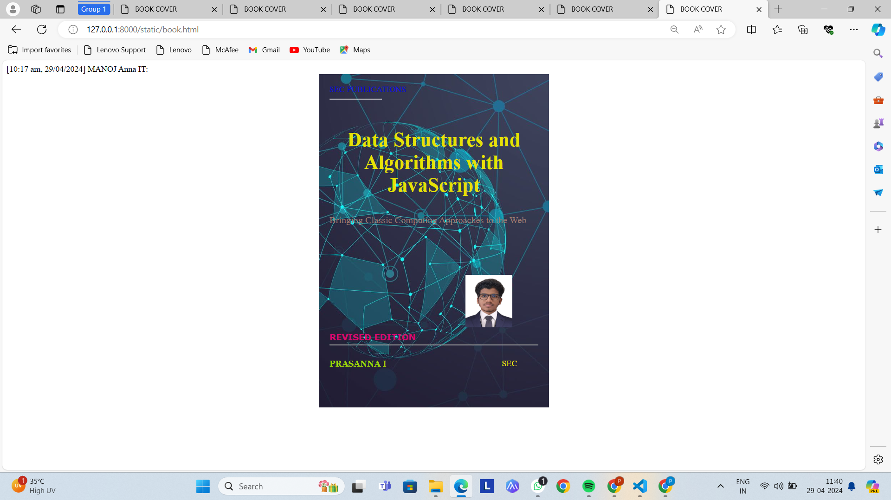

# Ex.06 Book Front Cover Page Design
## Date:22-03-2024

## AIM:
To design a book front cover page using HTML and CSS.

## DESIGN STEPS:

### Step 1:
Create a Django Admin project.

### Step 2:
Create an app in the Django interface.

### Step 3:
Create a folder named 'static' in the app folder.

### Step 4:
Create a new HTML file in the static folder.

### Step 5:
Write the HTML code with relevant CSS properties.

### Step 6:
Choose the appropriate style and color scheme.

### Step 7:
Insert the images in their appropriate places.

### Step 8:
Publish the website in the LocalHost.

## PROGRAM:
```
<!DOCTYPE html>
<html>

<head>
    <title>BOOK COVER</title>
    <style>
        .bookcover{

            width: 400px;
            height: 600px;
            color:black;
            margin-left: auto;
            margin-right: auto;
            padding: 20px;
            font-family: ' Arial, sans-serif';
            background-image: url(BAG.jpeg);
            background-size: cover;
        }
            
        
        .head{
            color:rgb(7, 7, 225);
        
        }
        
        
        .style{
            width:100px;
        }
        .authorname{
        
            display: inline;
            position: relative;
            color:rgb(159, 213, 8);
            top:190px;
            
            font-family:Georgia;
            font-size: medium;
        }
        .title{
            color:rgb(230, 226, 4);
            font-family: Roquen;
            font-size: larger;
            text-align: center;
            position: relative;
            top: 30px;
        
        }
        .line {
            width:400px;
            position: relative;
            top:180px;
            
            
        }
        .last{
            color:rgb(245, 229, 9);
            font-size: medium;
            position: relative;
            top:155px;
            left:330px;
        }
        .end{
            color:rgba(231, 6, 115, 0.94);
            font-size: medium;
            font-family: Verdana;
            position:relative;
            top:85px;
        
        }
        .subtitle{
            color:rgb(158, 124, 114);
            font-family:unicorn;
            font-size: large;
            position: relative;
            top:40px;
        }
        .photo{
            position: relative;
            top: 135px;
            left: 260px;
            width: 90px;
            height: 80px;
            background-size:contain;
        }
        </style>
        <title>Book Cover Page</title>
        </head>
        <body>
        <div class="bookcover">
            <div class="head">
                SEC PUBLICATIONS
            </div>
            <div class="style">
                <hr style="color:rgb(32, 244, 8)">
            </div>
            <div class="title">
                <h1>Data Structures and Algorithms with JavaScript</h1></div>
            <div class="subtitle">
                Bringing Classic Computing Approaches to the Web
            </div>
            <div class="photo">
                
            </div>
            <div class="line">
                <hr style="color:rgba(7, 155, 235, 0.555)">
            </div>
            <div class="authorname">
               <p><b>PRASANNA I</b></p>
            </div>
            <div class="last">
                SEC
            </div>
            <div class="end">
                <b>REVISED EDITION</b>
            </div>
        </div>
        </body>
```

## OUTPUT:


## RESULT:
The program for designing book front cover page using HTML and CSS is completed successfully.
